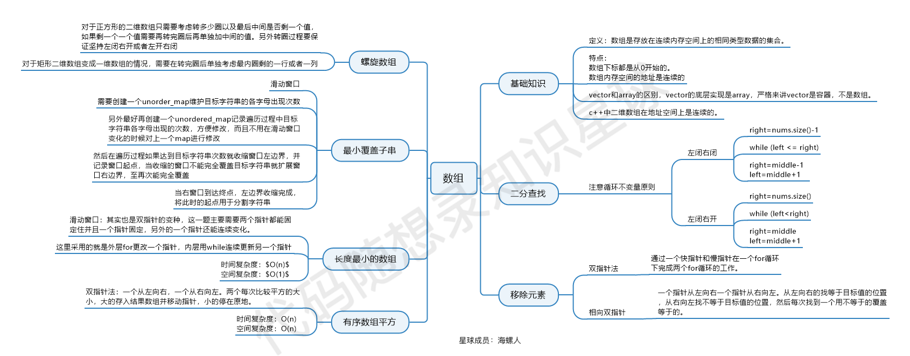

# Day 2: Arrays (977 209 59)

- [数组总结篇](https://programmercarl.com/%E6%95%B0%E7%BB%84%E6%80%BB%E7%BB%93%E7%AF%87.html#%E6%95%B0%E7%BB%84%E7%90%86%E8%AE%BA%E5%9F%BA%E7%A1%80)



## 977.有序数组的平方 

题目建议： 本题关键在于理解双指针思想 

题目链接：https://leetcode.cn/problems/squares-of-a-sorted-array/
文章讲解：https://programmercarl.com/0977.%E6%9C%89%E5%BA%8F%E6%95%B0%E7%BB%84%E7%9A%84%E5%B9%B3%E6%96%B9.html
视频讲解： https://www.bilibili.com/video/BV1QB4y1D7ep 


- Ideas
  - two pointers from left and right to the middle
- Complexity: 
  - Time: O(N)
  - Space: O(N)

- Code

```python
class Solution:
    def sortedSquares(self, nums: List[int]) -> List[int]:
        results = []
        #相向双指针！
        left, right = 0, len(nums) - 1
        while left <= right: #be careful about =!
            if nums[left]**2 < nums[right] ** 2:
                results = [nums[right]**2] + results  #append to beginning!
                right -= 1
            else:
                results = [nums[left]**2] + results
                left += 1
            #print (results)
        return results

        #或者i = len(nums) -1, 然后i -= 1 results[i] = ...来维护倒着写的情况
```


--- 


##  209.长度最小的子数组

题目建议： 本题关键在于理解滑动窗口，这个滑动窗口看文字讲解 还挺难理解的，建议大家先看视频讲解。  拓展题目可以先不做。 

题目链接：https://leetcode.cn/problems/minimum-size-subarray-sum/
文章讲解：https://programmercarl.com/0209.%E9%95%BF%E5%BA%A6%E6%9C%80%E5%B0%8F%E7%9A%84%E5%AD%90%E6%95%B0%E7%BB%84.html
视频讲解：https://www.bilibili.com/video/BV1tZ4y1q7XE


- Ideas
  - sliding windows! very classic
- Complexity: 
  - Time: O(N)
  - Space: O(1)


- Code
```dotnetcli
class Solution:
    def minSubArrayLen(self, target: int, nums: List[int]) -> int:
        #经典滑动窗口，right一个一个滑，left尽量滑，滑到不满足条件了再left
        if sum(nums) < target:
            return 0
        left, right = 0, 0
        minlength = len(nums)
        cursum = 0
        while right <= len(nums) - 1:
            cursum += nums[right]
            while cursum >= target:
                cursum -= nums[left]
                minlength = min(minlength, right - left + 1)
                left += 1

            right += 1
        return minlength
        #或者 min_len = float('inf')  return min_len if min_len != float('inf') else 0
        
```

---

##  59.螺旋矩阵II

题目建议：  本题关键还是在转圈的逻辑，在二分搜索中提到的区间定义，在这里又用上了。 

题目链接：https://leetcode.cn/problems/spiral-matrix-ii/
文章讲解：https://programmercarl.com/0059.%E8%9E%BA%E6%97%8B%E7%9F%A9%E9%98%B5II.html
视频讲解：https://www.bilibili.com/video/BV1SL4y1N7mV/

大家还记得我们在这篇文章数组：每次遇到二分法，都是一看就会，一写就废 (opens new window)中讲解了二分法，提到如果要写出正确的二分法一定要坚持循环不变量原则。

而求解本题依然是要坚持循环不变量原则。

模拟顺时针画矩阵的过程:

填充上行从左到右
填充右列从上到下
填充下行从右到左
填充左列从下到上
由外向内一圈一圈这么画下去。

这里一圈下来，我们要画每四条边，这四条边怎么画，每画一条边都要坚持一致的左闭右开，或者左开右闭的原则，这样这一圈才能按照统一的规则画下来。

- Complexity: 
  - Time: O(N)
  - Space: O(N)
  
- Code
```dotnetcli
class Solution:
    def generateMatrix(self, n: int) -> List[List[int]]:
        matrix = [[0] * n for _ in range(n)]
        num = 1
        top, bottom, left, right = 0, n - 1, 0, n - 1
        
        while top <= bottom and left <= right:
            for j in range(left, right + 1):
                matrix[top][j] = num
                num += 1
            top += 1
            
            for i in range(top, bottom + 1):
                matrix[i][right] = num
                num += 1
            right -= 1
            
            if top <= bottom:
                for j in range(right, left - 1, -1):
                    matrix[bottom][j] = num
                    num += 1
                bottom -= 1
                
            if left <= right:
                for i in range(bottom, top - 1, -1):
                    matrix[i][left] = num
                    num += 1
                left += 1
                
        return matrix 

```


```dotnetcli

class Solution:
    def generateMatrix(self, n: int) -> List[List[int]]:
        nums = [[0] * n for _ in range(n)]
        startx, starty = 0, 0               # 起始点
        loop, mid = n // 2, n // 2          # 迭代次数、n为奇数时，矩阵的中心点
        count = 1                           # 计数

        for offset in range(1, loop + 1) :      # 每循环一层偏移量加1，偏移量从1开始
            for i in range(starty, n - offset) :    # 从左至右，左闭右开
                nums[startx][i] = count
                count += 1
            for i in range(startx, n - offset) :    # 从上至下
                nums[i][n - offset] = count
                count += 1
            for i in range(n - offset, starty, -1) : # 从右至左
                nums[n - offset][i] = count
                count += 1
            for i in range(n - offset, startx, -1) : # 从下至上
                nums[i][starty] = count
                count += 1                
            startx += 1         # 更新起始点
            starty += 1

        if n % 2 != 0 :			# n为奇数时，填充中心点
            nums[mid][mid] = count 
        return nums
```